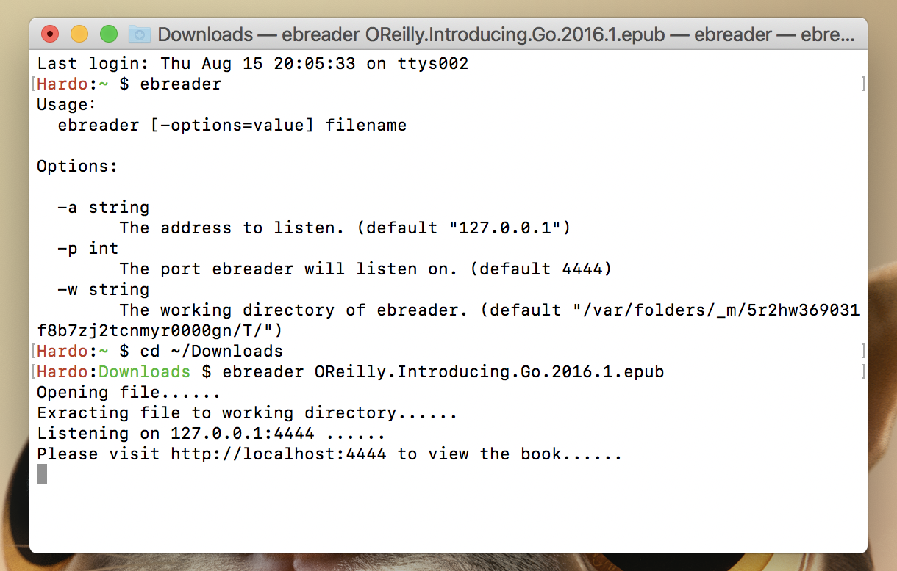
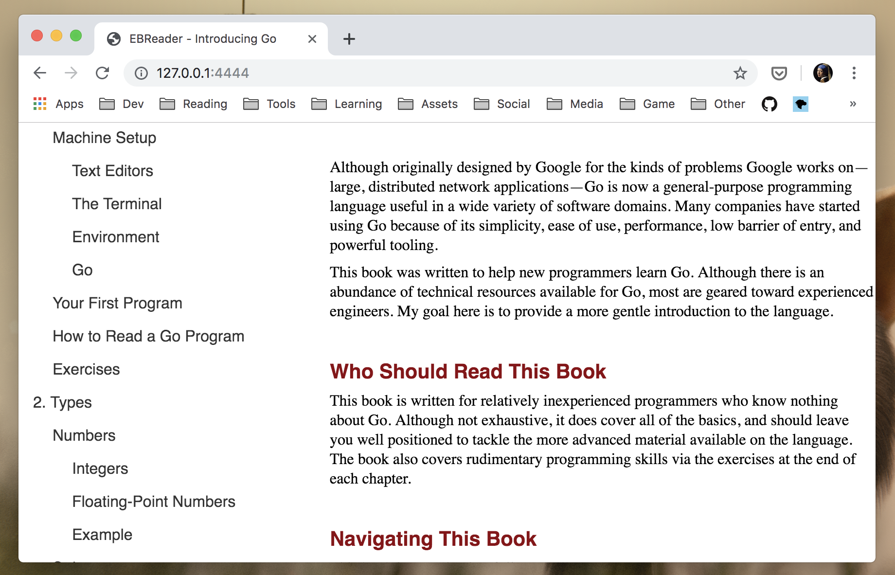

# EBReader
A epub reader for browser


## Install

- With GO:

```bash
cd $GOPATH/src
git clone https://github.com/hardo/ebreader

cd ebreader
go install
```

## Usage

- Type `ebreader file.epub` on terminal:

```bash
ebreader OReilly.Introducing.Go.2016.1.epub 

# Opening file......
# Extracting file to working directory......
# Listening on 127.0.0.1:4444 ......
# Please visit http://localhost:4444 to view the book......
```

- Then open browser，visit `http://localhost:4444`

## Options

```bash
-a string
    The address to listen. (default "127.0.0.1")
-p int
    The port ebreader will listen on. (default 4444)
-w string
    The working directory of ebreader. (default "/tmp")
```

## Example

- Run：



- browse:


